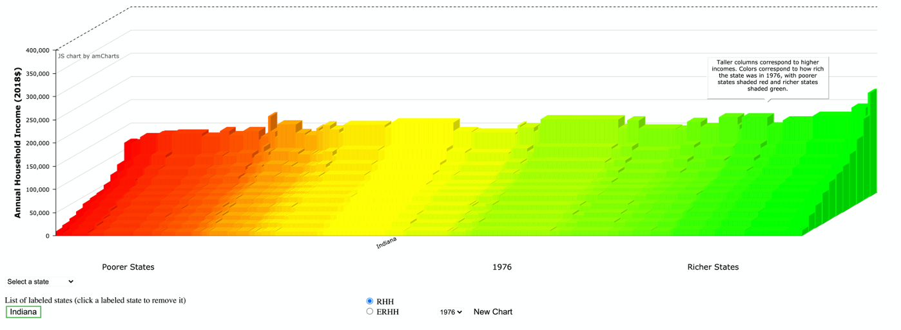

## Motivation
Information about the distribution of income is communicated by tabulation and statistics (e.g., the Gini coefficient). These can be difficult to understand and often require expert knowledge. Our goal is to provide a novel, eye-catching visual display of the income distribution in the United States that conveys fundamental information about the evolution and current level of income inequality to a wide audience. We use IPUMS CPS data to create household income deciles adjusted for price level and household size for each of the 50 states and the District of Columbia from 1976 to 2018. Plotting these data gives a 3D chart that provides a startling picture of income differences within and across states over time. The visualization is thought provoking and can be used at all levels to stimulate further investigation: [research.depauw.edu/econ/IncIneq](https://research.depauw.edu/econ/IncIneq/).
